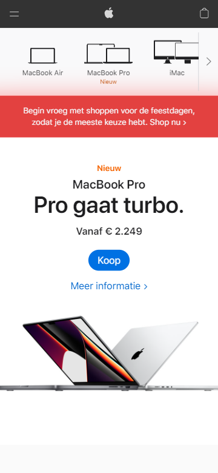

# Procesverslag
 
### Auteur:
Casper den Nijs

#### Je startniveau:
Zwart

#### Je focus:
Responsive

## Je website

### Je opdracht:
https://www.apple.com/nl

#### Screenshot(s) van de eerste pagina (small screen): 
Mac - Apple (NL) (https://www.apple.com/nl/mac/)

#### Screenshot(s) van de tweede pagina (small screen):
Apple Store Online - Apple (NL) (https://www.apple.com/nl/store)

 

## Breakdownschets (week 1)

### de hele pagina: 

### dynamisch deel (bijv menu): 

### wellicht nog een dynamisch deel (bijv filter): 

## Voortgang 1 (week 2)

### Stand van zaken
Bijna helemaal klaar met de content voor de eerste pagina. Al een klein beetje zitten stylen voor de eerste content.

### Verslag van meeting
- Content afronden
- Beginnen met stylen

## Voortgang 2 (week 3)

### Stand van zaken
Halverwege met pagina 1. De pagina is ook nog niet responsive. Content is wel helemaal aanwezig, maar nog niet helemaal gestyled.

### Verslag van meeting
- Styling verder afmaken
- Beginnen met responsive design voor desktop

## Toegankelijkheidstest (week 4)

### Bevindingen
Lijst met je bevindingen die in de test naar voren kwamen:

#### Niet alles was te bereiken met de tab knop
Sommige knoppen in het menu en de pagina zelf kon je nog niet met tab drukken bereiekn

Oplossing: Linkjes toevoegen bij de benodigde elementen waar het nog mis of anders tabindex toevoegen in HTML.

## Voortgang 3 (week 4)

### Stand van zaken
Vooruitgang geboekt en pagina 1 zo goed als af. Door planning loop ik achter op pagina 2 dus moet dit gaan inhalen.

### Verslag van meeting
- Pagina 1 afmaken
- Beginnen aan pagina 2

## Eindgesprek (week 5)

### Stand van zaken
Beide pagina's zijn inmiddels af en responsive.

### Screenshot(s)

hier screenshot(s) van je eindresultaat

## Bronnenlijst

1. Broncode van de Apple pagina's zelf.
2. https://stackoverflow.com/questions/38213329/how-to-add-css3-transition-with-html5-details-summary-tag-reveal
3. https://developer.mozilla.org/en-US/docs/Web/API/Element/scrollLeft

